## 🧰 Tools & Libraries Used
- Python  
- Pandas  
- NumPy
- matplotlib.pyplot
- Jupyter Notebook

---

## 🔍 Analysis Workflow

### 1. Data Loading & Inspection
- Imported required libraries & Loaded the dataset
  
  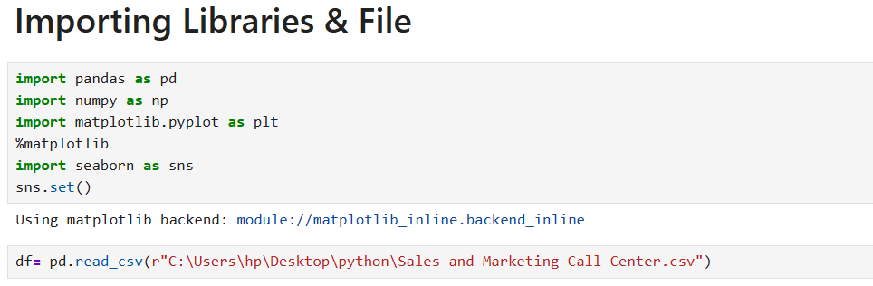
  
- Checked data types, missing values, and general statistics
  
  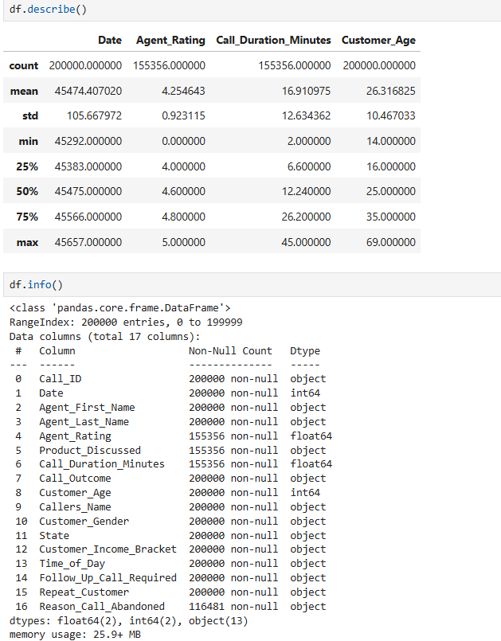

### 2. Data Cleaning
- Handled missing values using median and logical defaults & Removed unnecessary columns

  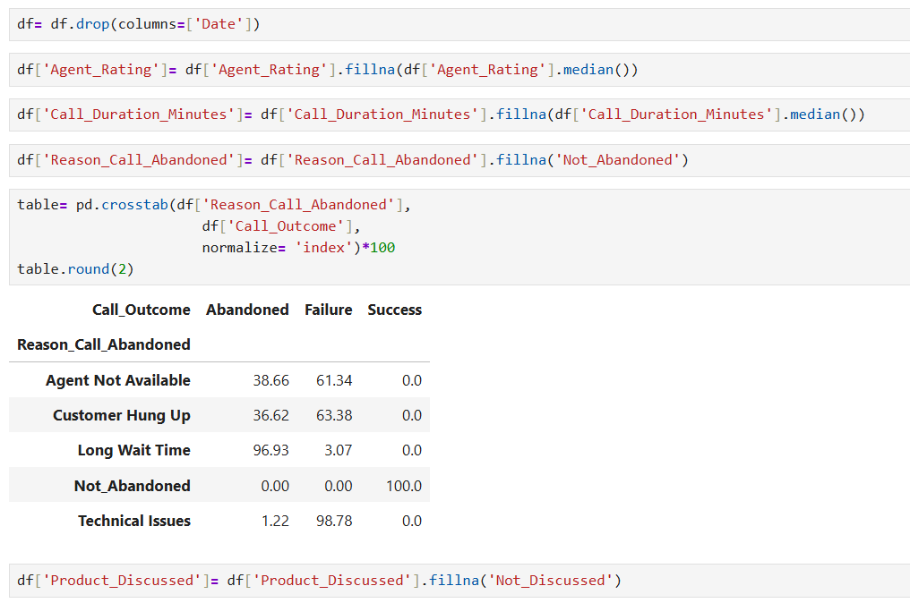
  
- Created a unified agent full name column & Standardized text columns

  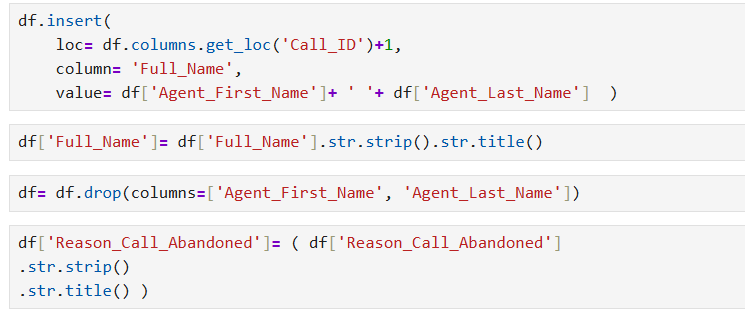

### 3. Feature Engineering
- Converted categorical Yes/No columns to numerical values

                             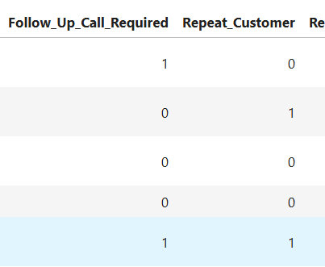

  
- Created call duration categories & Grouped customer ages into meaningful age groups

  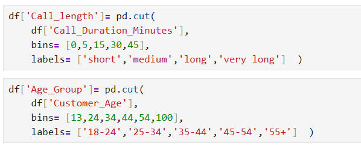                          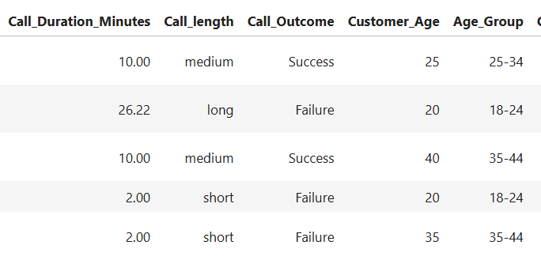

- Reordered columns for better readability

  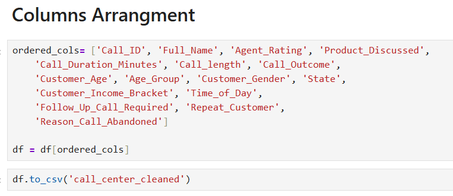

### 4. Exploratory Data Analysis (EDA)
The analysis answers key business questions such as:
- What are the main reasons for call abandonment?

  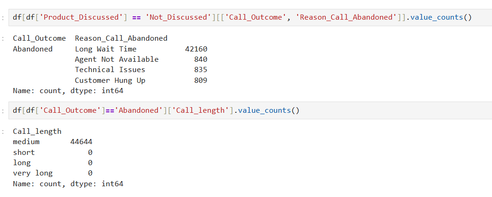
  
- Which products have the highest failure rate?

  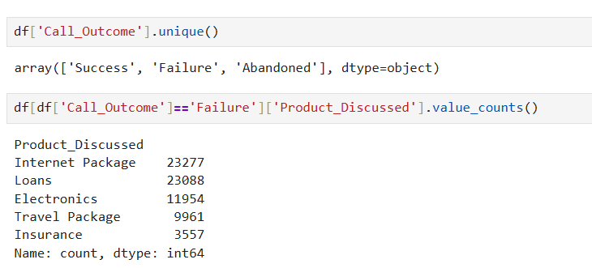

- Which products require more follow-up calls?

  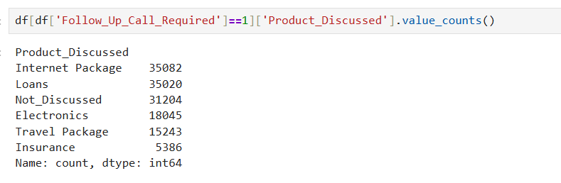

- Do repeat customers require more follow-ups?

  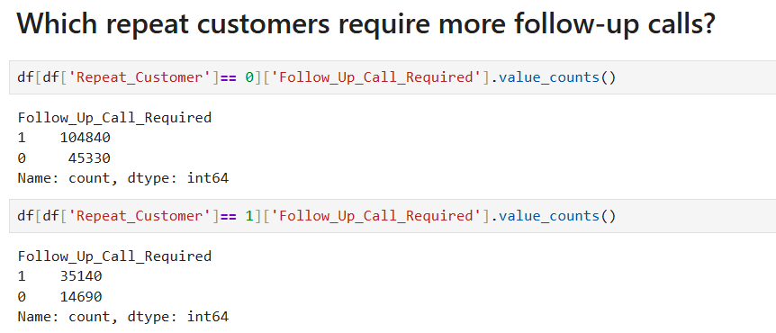

- Is there a relationship between call outcome and time of day?

  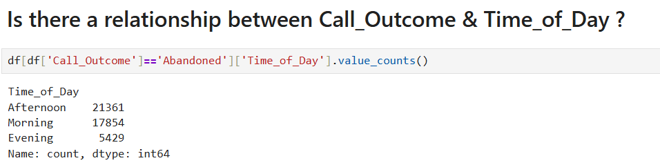

---

## 📊 Key Insights
- Long wait time is the primary reason for call abandonment
- Certain products show higher failure and follow-up rates
- Repeat customers tend to require fewer follow-up calls
- Call outcomes vary depending on the time of day

---

## 📁 Output
- A cleaned and structured dataset ready for further analysis or visualization:
  - `call_center_cleaned.csv`
